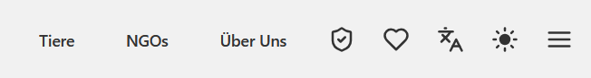
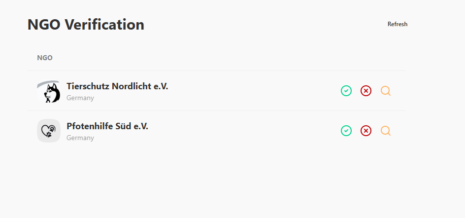
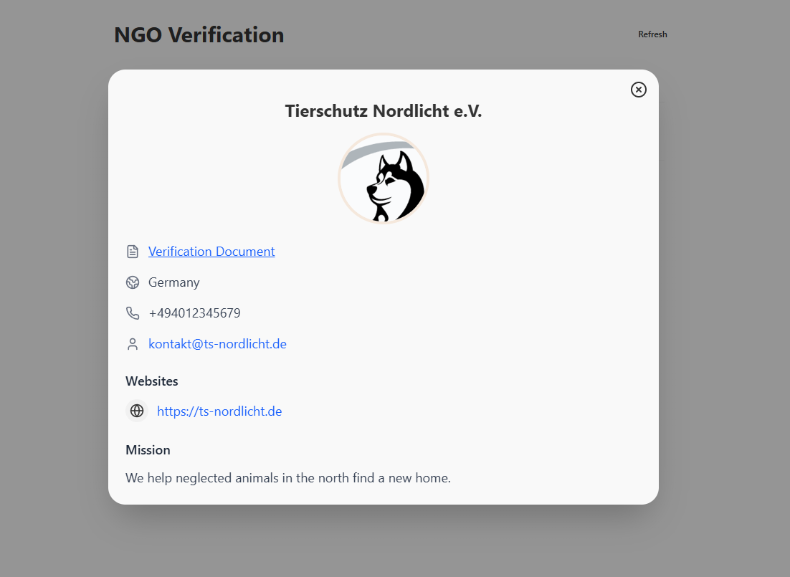

### Überprüfung der Verifikationsdokumente
1. Stellen Sie sicher, dass Sie als Webseiten-Administrator angemeldet sind.
2. Klicken Sie oben rechts auf das Schild-Icon.

3. Sie sehen nun eine Übersicht aller NGOs, bei denen die Verifizierung noch aussteht.

4. Klicken Sie auf eine NGO, um die Detailansicht aufzurufen und das Verifikationsdokument einzusehen.

5. Genehmigen Sie die Verifizierung oder lehnen Sie die Verifizierung ab.
