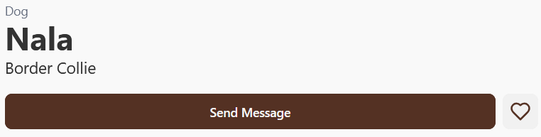

### Die Kontaktaufnahme zum NGO
Wenn Sie an einem Tier interessiert sind und am Vermittlungsprozess teilnehmen wollen, dann:
1. Begeben Sie sich auf das Tierprofil.
2. Klicken Sie auf den "Send Message"-Button.

3. Es sollte sich ein neues Fenster öffnen, in dem Sie dem verantwortlichen NGO-Mitglied eine Nachricht per E-Mail schicken können.
4. Das NGO-Mitglied nimmt Kontakt zu Ihnen auf, wenn Sie als Kandidat in Frage kommen.
