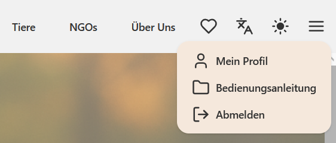
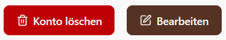
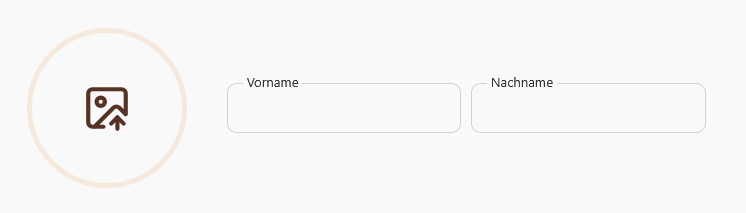
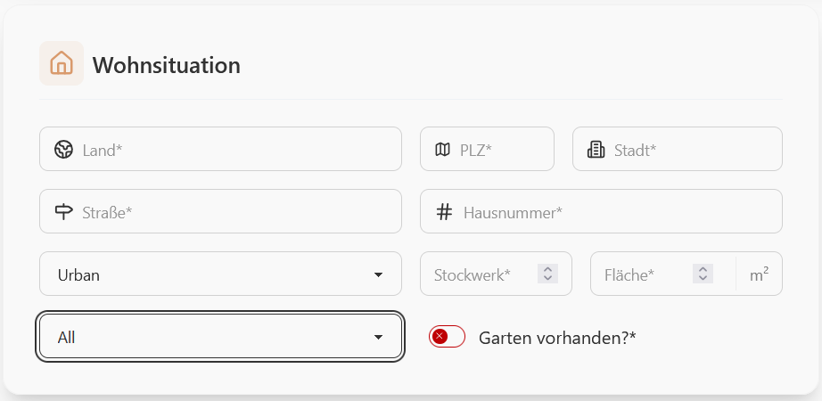
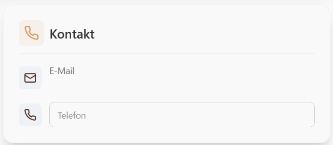
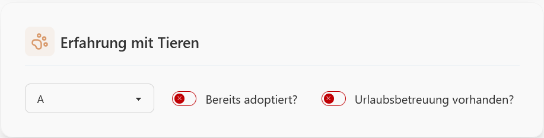
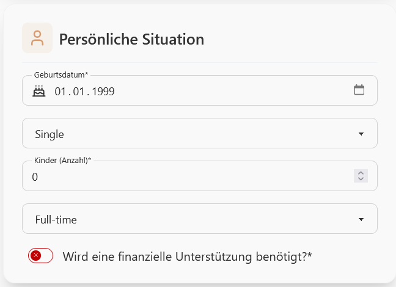
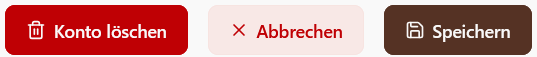

### Dein Halterprofil
1. Klicken Sie oben rechts auf ☰ und dann auf "Mein Profil".

2. Klicken Sie auf "Bearbeiten".

3. Sie können nun ihr Profilbild, ihren Namen, ihre Wohnsituation, ihre Kontaktdaten, ihre Erfahrungsinformationen und ihre persönliche Situation bearbeiten.

4. Vergessen Sie nicht oben rechts auf "Speichern" zu klicken, wenn Sie mit ihren Änderungen fertig sind.
