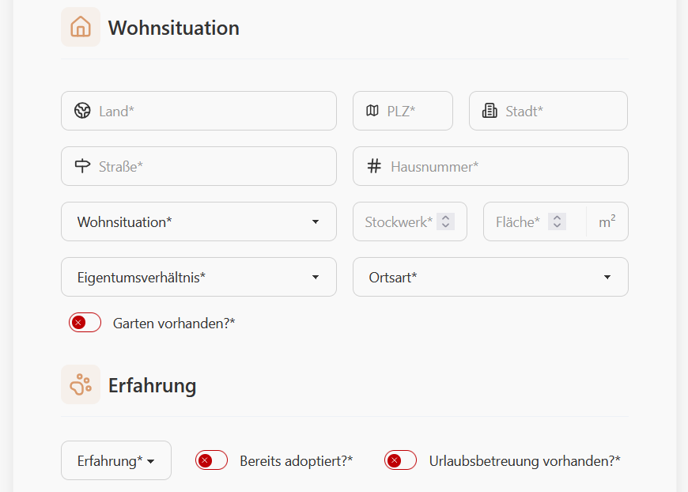
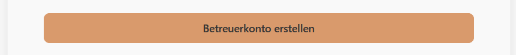
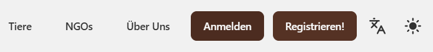

### Registrierung
1. Begeben Sie sich auf die Startseite und klicken Sie oben rechts auf "Registrieren!".

2. Wählen Sie "Halter" aus und füllen Sie die Felder Vorname, Nachname, E-Mail und Passwort aus.

3. Klicken Sie auf "Konto Erstellen"
4. Geben Sie ihre persönlichen Informationen ein.

5. Geben Sie ihre aktuelle Wohnsituation, sowie ihre bisherige Erfahrung mit Tieren an.

6. Geben Sie ihre verfügbaren Betreuungszeiten an.

7. Klicken Sie zum Schluss auf "Betreuerkonto erstellen".

### Login
1. Begeben Sie sich auf die Startseite und klicken Sie oben rechts auf "Anmelden".

2. Geben Sie ihr E-Mail und Passwort ein.

