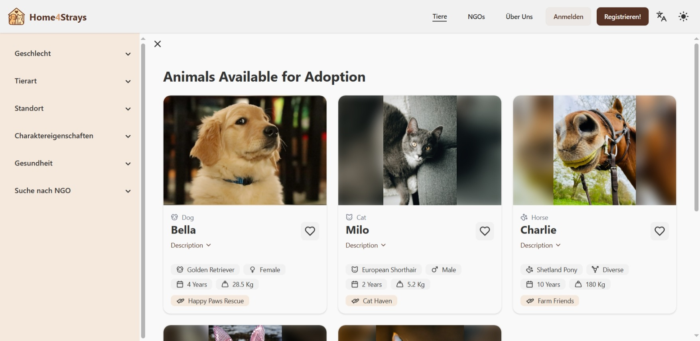

### Das Tierverzeichnis

Auch ohne Anmeldung können Nutzer alle veröffentlichten Tierprofile ansehen und nach Tieren suchen.

So kommen Sie zum Tierverzeichnis:
1. Begeben Sie sich auf die [Homepage unter home4strays.org.](https://home4strays.org)

2. Klicken Sie oben rechts auf den Reiter "Tiere" oder alternativ auf "Alle Tiere".
 

3. Sie befinden sich nun im Tierverzeichnis.

### Suche nach bestimmten Tieren

In der Seitenleiste können Sie nach folgenden Kriterien für ein Tier filtern:
- Geschlecht
- Tierart, Tierrasse und Tieralter 
- Standort 
- Charaktereigenschaften
- Gesundheitlicher Zustand
- NGO-Zugehörigkeit

### Suche auf der Startseite

Alternativ können Sie auf der Startseite anhand gewünschter Suchbegriffe, Tierart und Standort suchen.
