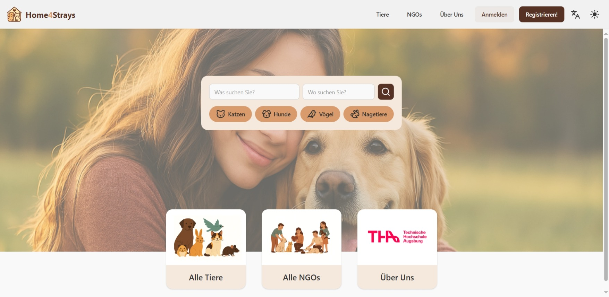

### Die NGO-Übersicht

Auch ohne Anmeldung können Nutzer alle NGO-Profile ansehen und nach NGOs suchen.

So kommen Sie zur NGO-Übersicht:
1. Begeben Sie sich auf die [Homepage unter home4strays.org.](https://home4strays.org)

2. Klicken Sie oben rechts auf den Reiter "NGOs" oder alternativ auf "Alle NGOs".
 

3. Sie befinden sich nun in der NGO-Übersicht.

### Suche nach bestimmten NGOs

In der Seitenleiste können Sie nach folgenden Kriterien für eine NGO filtern:
- Name
- Standort
- Verifizierungsstatus
- Anzahl der Mitglieder