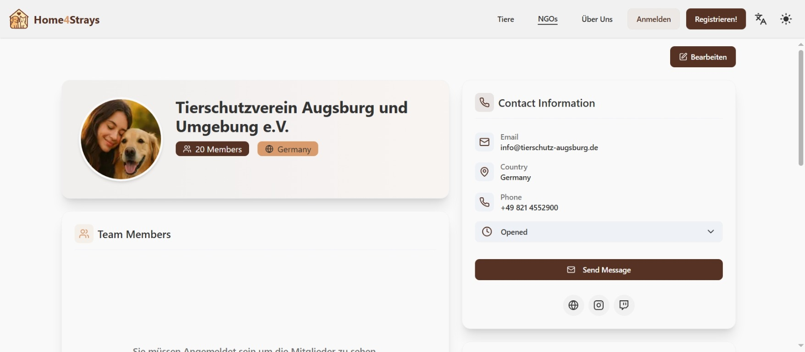
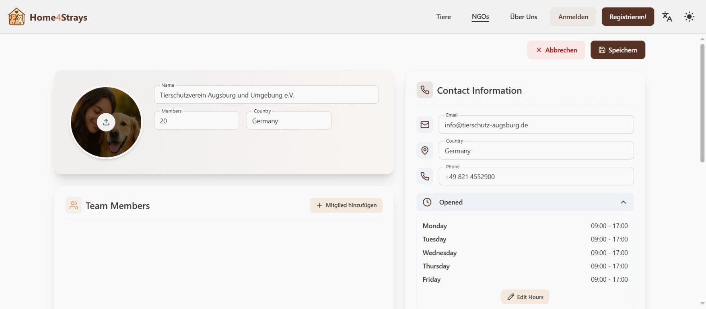
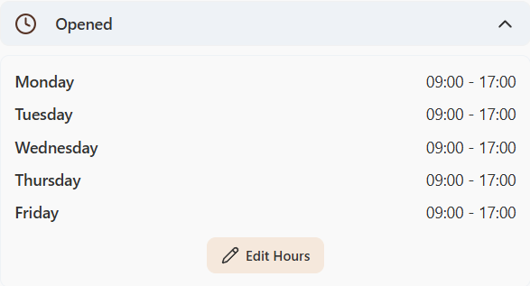
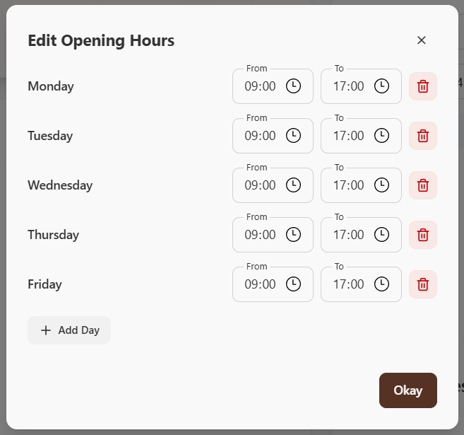

### Bearbeitung des NGO-Profils
1. Begeben Sie sich zuerst zu ihrem NGO-Profil.

2. Klicken Sie oben rechts auf "Bearbeiten".
3. Ändern Sie die gewünschten Informationen, indem Sie die Textfelder überschreiben.

4. Sobald Sie fertig mit ihren Änderungen sind, klicken Sie oben rechts auf "Speichern" oder alternativ können Sie den Bearbeitungsprozess abbrechen.

### Änderung der Öffnungszeiten
Während Sie sich im Bearbeitungsprozess befinden, können Sie auch die Öffnungszeiten ihrer NGO ändern.
1. Stellen Sie sicher, dass Sie sich im Bearbeitungsmodus befinden.
2. Klappen Sie die Öffnungszeiten ihrer NGO auf.

3. Sie sollten nun die bisherigen Öffnungszeiten ihrer NGO sehen. Klicken Sie auf "Edit Hours".

4. Es sollte ein Fenster erscheinen, in dem Sie die Öffnungszeiten für jeden Tag einstellen, Tage hinzufügen und Tage löschen können. Klicken Sie auf "Okay", sobald Sie fertig sind.

5. Vergessen Sie zum Schluss nicht, alle Änderungen zu Speichern oder den Bearbeitungsmodus abzubrechen.

