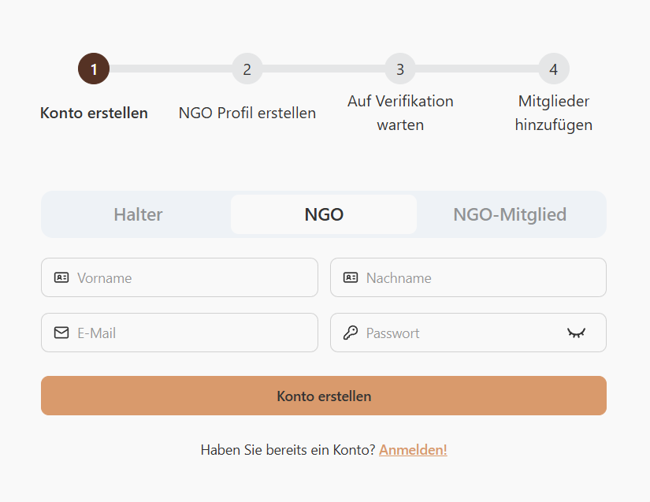
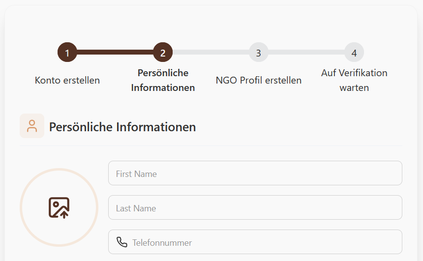
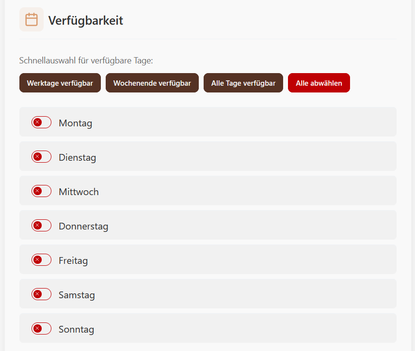
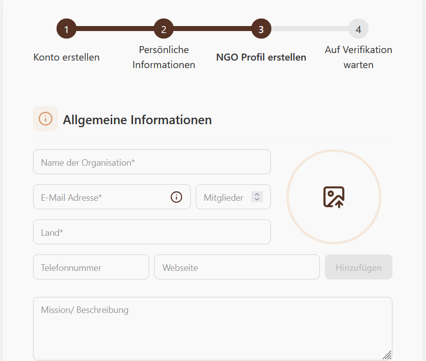
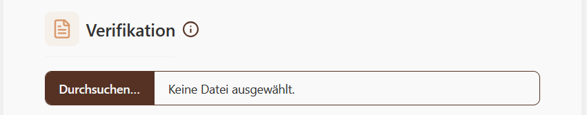
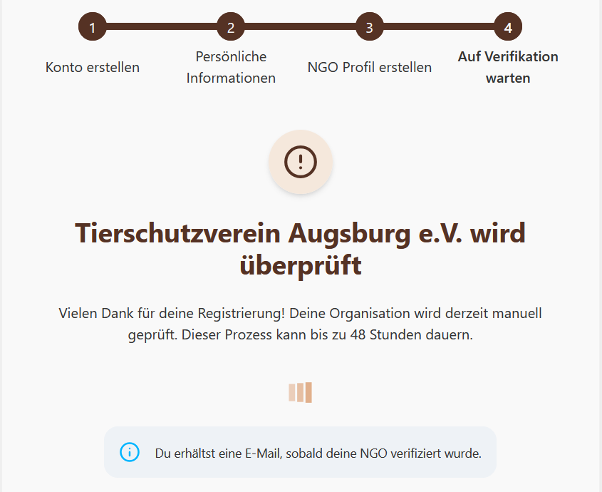
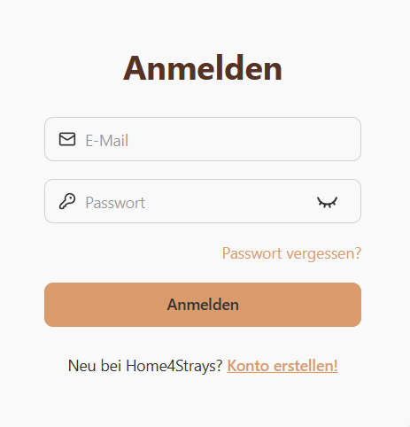

### Registrierung der NGO und Hochladen des Verifikationsdokuments
1. Begeben Sie sich auf die Startseite und klicken Sie oben rechts auf "Registrieren!".

2. Wählen Sie "NGO" aus und füllen Sie die Felder Vorname, Nachname, E-Mail und Passwort aus.

3. Klicken Sie auf Konto erstellen.
4. Geben Sie die Informationen für Ihr NGO-Mitgliedsprofil an.

5. Geben Sie ihre verfügbaren Zeiten an.

6. Klicken Sie auf NGO-Konto erstellen.

7. Geben Sie nun die allgemeinen Informationen für Ihre NGO an.

8. Laden Sie ihre Verifikationsdokumente hoch.

9. Ihre NGO ist nun registriert. Ihre Verifikationsdokumente werden jetzt manuell geprüft. Sie werden per E-Mail benachrichtigt, sobald Sie erfolgreich verifiziert wurden.

### Login
1. Begeben Sie sich auf die Startseite und klicken Sie oben rechts auf "Anmelden".

2. Geben Sie ihr E-Mail und Passwort ein.

