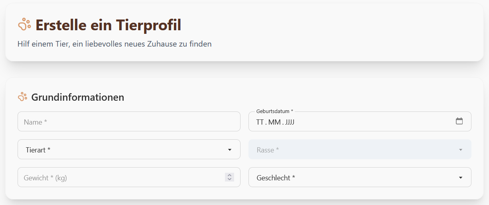
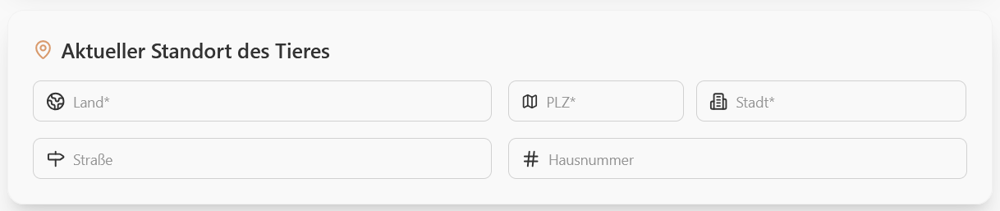
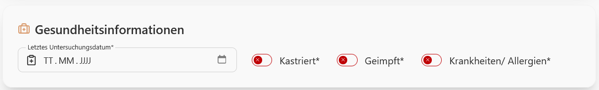
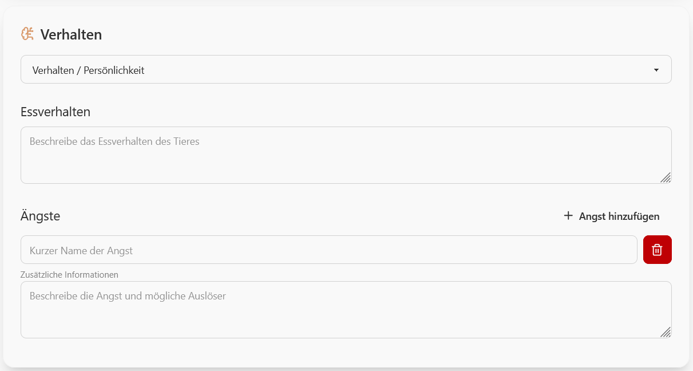
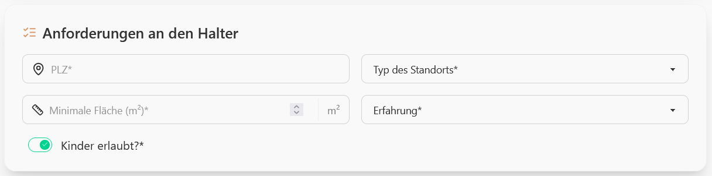
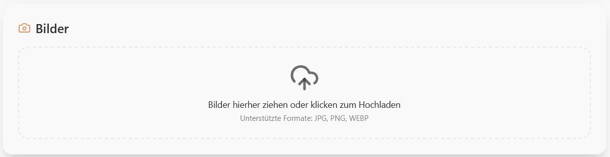
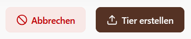

### Tierprofil erstellen
1. Klicken Sie auf "Tier erstellen".
2. Geben Sie die Grundinformationen für das Tier an.

3. Geben Sie den aktuellen Standort des Tiers an.

4. Geben Sie den gesundheitlichen Zustand des Tiers an.

5. Geben Sie alles zu dem Verhalten des Tiers an.

6. Geben Sie die Anforderungen an einen Tierhalter an.

7. Laden Sie Bilder des Tiers hoch. 

8. Klicken Sie auf "Tier erstellen".

### Tierprofil bearbeiten
1. Begeben Sie sich zum Tierprofil, welches Sie bearbeiten wollen.
2. Klicken Sie oben rechts auf "Edit".
3. Ändern Sie die gewünschten Informationen.

### Tierprofil löschen
1. Begeben Sie sich zum Tierprofil, welches Sie bearbeiten wollen.
2. Klicken Sie oben rechts auf "Edit".
3. Klicken Sie auf Löschen.