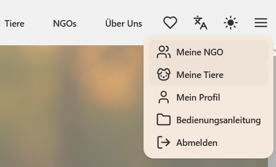
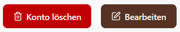
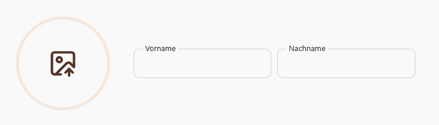
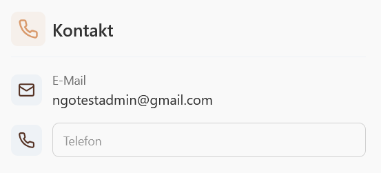
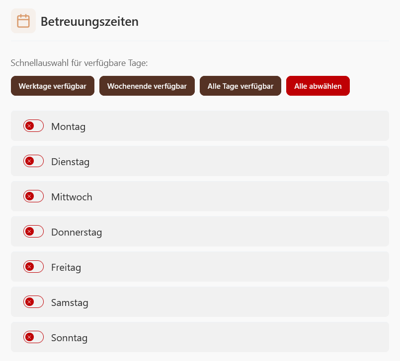

### Dein NGO-Mitgliedsprofil
1. Klicken Sie oben rechts auf ☰ und dann auf "Mein Profil".

2. Klicken Sie auf "Bearbeiten".

3. Sie können nun ihr Profilbild, ihren Namen, ihre Kontaktdaten und ihre Betreuungszeiten anpassen.

4. Vergessen Sie nicht oben rechts auf "Speichern" zu klicken, wenn Sie mit ihren Änderungen fertig sind.
