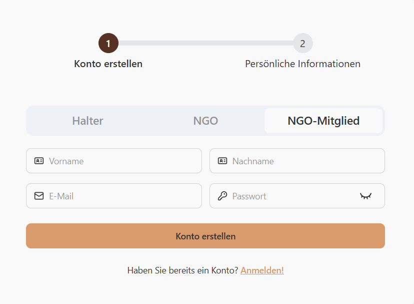

### Registrierung mit Invite-Link
Wenn ihre NGO bereits ein Profil auf der Plattform besitzt, fragen Sie ein NGO-Mitglied nach einer Einladung.
Diese Einladung wird ihnen anschließend per E-Mail zugeschickt.
1. Klicken Sie auf den Einladungslink in ihrem E-Mail Postfach.
2. Sie sollten nun zur Registrierungsseite weitergeleitet werden, wo Sie sich mit ihren Daten als NGO-Mitglied registrieren können.

3. Geben Sie ihre persönlichen Informationen ein.
4. Klicken Sie auf "Konto erstellen".

### Registrierung ohne Invite-Link
Sollte ihre NGO noch kein Profil auf der Plattform besitzen, so [registrieren Sie bitte ihre NGO](/docs/roles/ngo-admin/register#registrierung-der-ngo-und-hochladen-des-verifikationsdokuments) und folgen Sie den dort aufgeführten Schritten.

### Login
1. Begeben Sie sich auf die Startseite und klicken Sie oben rechts auf "Anmelden".

2. Geben Sie ihr E-Mail und Passwort ein.

